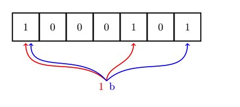

# 其他

### 跳表
链表加多级索引的结构，就是跳表(实现了基于链表的“二分查找”)。

> 跳表使用空间换时间的设计思路，通过构建多级索引来提高查询的效率，实现了基于链表的“二分查找”。
跳表是一种动态数据结构，支持快速的插入、删除、查找操作，时间复杂度都是`O(logn)`。 跳表的空间复杂度是`O(n)`。
不过，跳表的实现非常灵活，可以通过改变索引构建策略，有效平衡执行效率和内存消耗。

**时间复杂度:**
在跳表中查询某个数据的时候，如果每一层都要遍历m个结点，那在跳表中查询一个数据的时间复杂度就是`O(m*logn)`。

那这个m的值是多少呢?按照前面这种索引结构，我们每一级索引都最多只需要遍历`3`个结点，也就是说`m=3`，为什么是`3`呢?
假设我们要查找的数据是`x`，在第k级索引中，我们遍历到`y`结点之后，发现`x`大于`y`，小于后面的结点`z`，所以我们通过`y`的`down`指针，从第`k`级索引下降到第`k-1`级索引。在第`k-1`级索引中，`y`和`z`之间只有`3`个结点(包含`y`和`z`)，所以，我们在`K-1`级索引中最多只需要遍历`3`个结点，依次类推，每一级索引都最多只需要遍历`3`个结点。

通过上面的分析，我们得到`m=3`，所以在跳表中查询任意数据的时间复杂度就是`O(logn)`。这个查找的时间复杂度跟二分查找是一样的。换句话说，我们其实是基于单链表实现了二分查找;

**空间复杂度:**
比起单纯的单链表，跳表需要存储多级索引，肯定要消耗更多的存储空间。比如每两个节点建立索引，结点总和就是`n/2+n/4+n/8...+8+4+2=n-2`。所以，跳表的空间复杂度是`O(n)`。
如果我们增加节点建立索引，比之前的方法更节省索引结点存储空间。但是空间复杂度依然是`O(n)`;

实际上，在软件开发中，我们不必太在意索引占用的额外空间。原始链表中存储的有可能是很大的对象，而索引结点只需要存储关键值和几个指针，并不需要存储对象，所以当对象比索引结点大很多时，那索引占用的额外空间 就可以忽略了。

#### 跳表的操作
跳表这个动态数据结构，不仅支持查找操作，还支持动态的插入、删除操
作，而且插入、删除操作的时间复杂度也是`O(logn)`(主要是查找到索引的操作耗时, 单链表插入、删除操作的时间复杂度为`O(1)`)。

**跳表索引动态更新**
红黑树、`AVL`树这样平衡二叉树，它们是通过左右旋的方式保持左右子树的大小平衡，而跳表是通过**随机函数**来维护前面提到的“平衡性”。

当我们往跳表中插入数据的时候，我们可以选择同时将这个数据插入到部分索引层中。如何选择加入哪些索引层呢?
我们通过一个随机函数，来决定将这个结点插入到哪几级索引中，比如随机函数生成了值`K`，那我们就将这个结点添加到第一级到第`K`级这`K`级索引中。

**跳表和红黑树对比:**
* **跳表更容易代码实现**，虽然跳表的实现也不简单，但比起红黑树来说还是好懂、好写多了，而简单就意味着可读性好，不容易出错。
* **跳表更加灵活**，它可以通过改变索引构建策略，有效平衡执行效率和内存消耗。
* 但是实际开发中，红黑树直接拿来用，因为**红黑树比跳表的出现要早一些**。很多编程语言中的`Map`类型都是通过红黑树来实现的。但是跳表并没有一个现成的实现，必须要自己实现。

### 并查集
并查集主要用于解决一些元素分组的问题。它管理一系列**不相交的集合**，并支持两种操作(不支持分割一个集合)：
* **合并**（`Union`）：把两个不相交的集合合并为一个集合。
* **查询**（`Find`）：查询两个元素是否在同一个集合中。

#### 算法
用集合中的某个元素来代表这个集合，该元素称为集合的代表元。
一个集合内的所有元素组织成以代表元为根的树形结构。
对于每一个元素 `parent[x]`指向`x`在树形结构上的父亲节点。如果`x`是根节点，则令`parent[x] = x`。
对于查找操作，假设需要确定x所在的的集合，也就是确定集合的代表元。可以沿着`parent[x]`不断在树形结构中向上移动，直到到达根节点。

> 判断两个元素是否属于同一集合，只需要看他们的代表元是否相同即可。

#### 路径压缩
> 为了加快查找速度，查找时将x到根节点路径上的所有点的`parent`设为根节点，该优化方法称为压缩路径。
 使用该优化后，平均复杂度可视为`Ackerman`函数的反函数，实际应用中可粗略认为其是一个常数。

#### 用途
1. 维护无向图的连通性。支持判断两个点是否在同一连通块内。
2. 判断增加一条边是否会产生环：用在求解最小生成树的`Kruskal`算法里。

* [算法学习笔记: 并查集](https://zhuanlan.zhihu.com/p/93647900)
* [并查集入门-segmentfault](https://segmentfault.com/a/1190000004023326)

### 布隆过滤器
#### 位图(`BitMap`)
`Bitmap`又叫做位图，判断数组中的某位索引值下的位是否为`1`，来表示这个数是否存在。假如`53`存在，那么就将数组中的第`53`位置`1`。这样`Bitmap`极大地压缩了所需要的内存空间，并且还额外地完成了对原始大型数据的排序工作。使用位图可以大大节省元素存储空间，并进行快速查找、排序、判重、删除等工作。

不过，很多语言中提供的布尔类型，大小是`1`个字节的，并不能节省太多内存空间。实际上，表示`true`和`false`两个值，我们只需要用一个二进制位(`bit`)就可以了。

从刚刚位图结构的讲解中，你应该可以发现，位图通过数组下标来定位数据，所以，访问效率非常高。而且，每个数字用一个二进制位来表示，在数字范围不大的情况下，所需要的内存空间非常节省。

#### 布隆过滤器(`Bloom filter`)
然而`Bitmap`不是万能的，如果数据量大到一定程度，消耗的内存空间，不降反增。这个时候，布隆过滤器就要出场了。布隆过滤器就是为了解决刚刚这个问题，对位图这种数据结构的一种改进。

`Bloom filter`，是由 `Howard Bloom` 在 `1970` 年提出的二进制向量数据结构，适合与比`Bitmap`更多量的数据，通过图片看一下方法流程:
1. 初始化一块大内存用于存放`01`标志位

2. 通过使用`N`个`hash`函数(`N==3`)，对同一个值`Hash`多次哈希，然后同`Bitmap`一样映射到`Bloom filter`中去

3. 检测时，同样通过`N`次哈希，在映射的位中去找，并要保持映射的每一位都是`1`的情况下，即检测处包含关系。对于两个不同的数字来说，经过一个哈希函数处理之后，可能会产生相同的哈希值。但是经过`K`个哈希函数处理之后，`K`个哈希值都相同的概率就非常低了。尽管 采用`K`个哈希函数之后，两个数字哈希冲突的概率降低了，但是，这种处理方式又带来了新的问题，那就是容易误判。

布隆过滤器的误判有一个特点，那就是，它只会**对存在的情况有误判**。如果某个数字经过布隆过滤器判断不存在，那说明这个数字真的不存在，不会发生误判; 如果某个数字经过布隆过滤器判断存在，这个时候才会有可能误判，有可能并不存在。不过，只要我们***调整哈希函数的个数、位图大小跟要存储数字的个数之间的比例***，那就可以将这种误判的概率降到非常低。

应用:
位图、布隆过滤器应用如此广泛，很多编程语言都已经实现了。比如`Java`中的`BitSet`类就是一个位图，`Redis`也提供了`BitMap`位图类，`Google`的`Guava`工具包提供了`BloomFilter`布隆过滤器的实现。

小结:
 布隆过滤器的误判率，主要跟哈希函数的个数、位图的大小有关。当我们往布隆过滤器中不停地加入数据之后，位图中不是`true`的位置就越来越少 了，误判率就越来越高了。所以，对于无法事先知道要判重的数据个数的情况，我们需要支持自动扩容的功能。
当布隆过滤器中，数据个数与位图大小的比例超过某个阈值的时候，我们就重新申请一个新的位图。后面来的新数据，会被放置到新的位图中。但是，如果我们 要判断某个数据是否在布隆过滤器中已经存在，我们就需要查看多个位图，相应的执行效率就降低了一些。

* [bitmap与bloomfilter](https://blog.csdn.net/ivysister/article/details/50987562)

### LRU
`LRU`全称是`Least Recently Used`，即最近最久未使用的意思。

`LRU`算法的设计原则是：如果一个数据在最近一段时间没有被访问到，那么在将来它被访问的可能性也很小。也就是说，当限定的空间已存满数据时，应当把最久没有被访问到的数据淘汰。

常见的缓存算法
* `LRU` (`Least recently used`) 最近最少使用，如果数据最近被访问过，那么将来被访问的几率也更高。
* `LFU` (`Least frequently used`) 最不经常使用，如果一个数据在最近一段时间内使用次数很少，那么在将来一段时间内被使用的可能性也很小。
* `FIFO` (`Fist in first out`) 先进先出， 如果一个数据最先进入缓存中，则应该最早淘汰掉。

区别:
* LFU和LRU算法的不同之处，`LRU`的淘汰规则是**基于访问时间**，而`LFU`是**基于访问次数**的。

实现`LRU`
1. 用一个数组来存储数据，给每一个数据项标记一个访问时间戳，每次插入新数据项的时候，先把数组中存在的数据项的时间戳自增，并将新数据项的时间戳置为`0`并插入到数组中。每次访问数组中的数据项的时候，将被访问的数据项的时间戳置为`0`。当数组空间已满时，将时间戳最大的数据项淘汰。

2. 利用一个链表来实现，每次新插入数据的时候将新数据插到链表的头部；每次缓存命中（即数据被访问），则将数据移到链表头部；那么当链表满的时候，就将链表尾部的数据丢弃。

3. 利用链表和`hashmap`。当需要插入新的数据项的时候，如果新数据项在链表中存在（一般称为命中），则把该节点移到链表头部，如果不存在，则新建一个节点，放到链表头部，若缓存满了，则把链表最后一个节点删除即可。在访问数据的时候，如果数据项在链表中存在，则把该节点移到链表头部，否则返回`-1`。这样一来在链表尾部的节点就是最近最久未访问的数据项。

对于第一种方法，需要不停地维护数据项的访问时间戳，另外，在插入数据、删除数据以及访问数据时，时间复杂度都是`O(n)`。对于第二种方法，链表在定位数据的时候时间复杂度为`O(n)`。所以在一般使用第三种方式来是实现`LRU`算法。

* [Leetcode进阶之路——LRU Cache C++三种解法](http://www.manongjc.com/article/40789.html)
* [LRU Cache-leetCode题目链接](https://leetcode.com/problems/lru-cache/)
