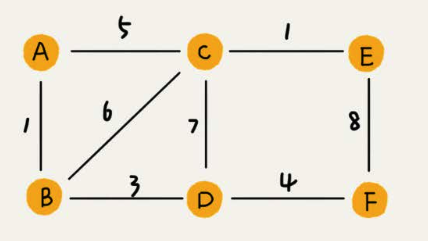
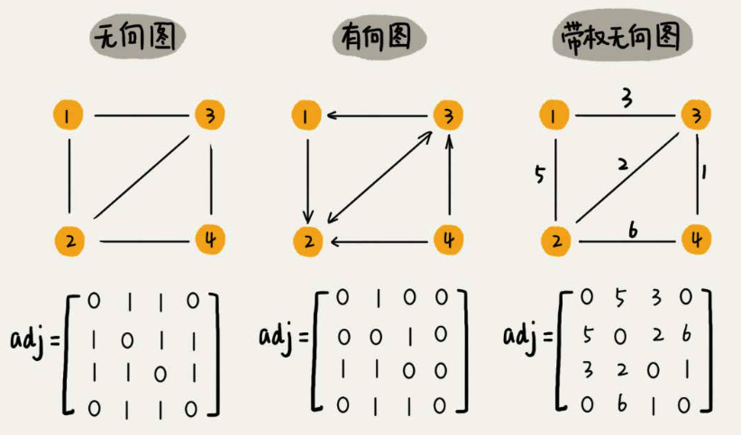
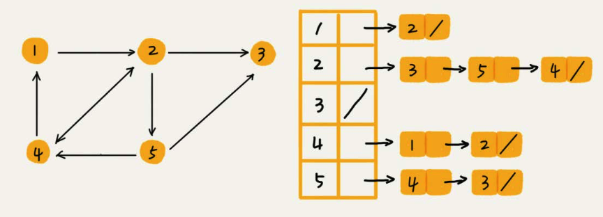

# 图

### 图相关知识
图(`Graph`)是由顶点的有穷非空集合和顶点之间边的集合组成，通常表示为：`G（V，E）`，其中，`G`表示一个图，`V`是图`G`中顶点的集合，`E`是图`G`中边的集合。在图中的数据元素，我们称之为顶点（`Vertex`），顶点集合有穷非空。在图中，任意两个顶点之间都可能有关系，顶点之间的逻辑关系用边来表示，边集可以是空的。

顶点的度(`degree`):就是跟顶点相连接的边的条数。
有向图:边有方向的图。
无向图:边没有方向的图。

顶点的入度(`In-degree`):有多少条边指向这个顶点。
出度(`Out-degree`):表示有多少条边是以这个顶点为起点指向其他顶点。

带权图(`weighted graph`):在带权图中，每条边都有一个权重(`weight`);

稀疏图:有很少条边。
稠密图:有很多条边。

[树-基本术语](https://blog.csdn.net/Ontheroad_/article/details/72739380)

#### 图的存储
##### 邻接矩阵存储方法
图最直观的一种存储方法就是，邻接矩阵(`Adjacency Matrix`)。

邻接矩阵的底层依赖一个二维数组。对于无向图来说，如果顶点`i`与顶点`j`之间有边，我们就将`A[i][j]`和`A[j][i]`标记为`1`;对于有向图来说，如果顶点`i`到顶点`j`之间，有一条箭头从顶点`i`指向顶点`j`的边，那我们就将`A[i][j]`标记为`1`。同理，如果有一条箭头从顶点`j`指向顶点`i`的边，我们就将`A[j][i]`标记为`1`。对于带权图，数组中就存储相应的权重。

优点:
* 简单,直观
* 查询效率高
   * 因为基于数组，所以在获取两个顶点的关系时，就非常高效。
* 方便矩阵运算
   * 用邻接矩阵的方式存储图，可以将很多图的运算**转换成矩阵之间的运算**。比如求解最短路径问题时会提到一个`Floyd-Warshall`算法，就是利用矩阵循环相乘若干次得到结果。

缺点:
* 浪费空间
   * 如果我们存储的是稀疏图(`Sparse Matrix`)，也就是说，顶点很多，但每个顶点的边并不多，那邻接矩阵的存储方法就更加浪费空间。

#### 邻接表存储方法
邻接表(`Adjacency List`):数组与链表相结合的存储方法。

优点:
* 方便查找任意顶点的所有"邻接点"
* 节省存储空间
* 方便计算任意顶点的度
   * 对于无向图:是的
   * 对于有向图:只能计算"出度";需要构造"**逆邻接表**"(存储的边)来方便计算"入度"

缺点:
* 不方便查找

优化:
* 链表换成更加高效的动态数据结构=>比如平衡二叉查找树、跳表、散列表、红黑树等。

小结:
邻接矩阵存储方法的缺点是比较浪费空间，但是优点是查询效率高，而且方便矩阵运算。邻接表存储方法中每个顶点都对应一个链表，存储与其相连接的其他顶点。尽管邻接表的存储方式比较节省存储空间，但链表不方便查找，所以查询效率没有邻接矩阵存储方式高。针对这个问题，邻接表还有改进升级版，即将链表换成更加高效的动态数据结构，比如平衡二叉查找树、跳表、散列表、红黑树等。

#### 图的遍历
图上的搜索算法，最直接的理解就是，在图中找出从一个顶点出发，到另一个顶点的路径。具体方法有很多，比如最简单、最“暴力”的深度优先、广度优先搜索，还有`A*`、`IDA*`等启发式搜索算法。

##### 广度优先搜索(BFS)
广度优先搜索(`Breadth-First-Search`)，我们平常都把简称为`BFS`。直观地讲，它其实就是一种“地毯式”层层推进的搜索策略，即先查找离起始顶点最近的，然后是次近的，依次往外搜索。类似于树的层次遍历。

##### 深度优先搜索(DFS)
深度优先搜索(`Depth-First-Search`)，简称`DFS`。从图中某个顶点v出发，访问此顶点，然后从`v`的未被访问的邻接点出发深度优先遍历图，直至图中所有和`v`有路径相通的顶点都被访问到。

* [图的BFS和DFS之C++实现](https://blog.csdn.net/starstar1992/article/details/68941763)

小结:
广度优先搜索和深度优先搜索是图上的两种最常用、最基本的搜索算法，比起其他高级的搜索算法，比如`A*`、`IDA*`等，要简单粗暴，没有什么优化，所以，也被叫作**暴力搜索算法**。所以，这两种搜索算法仅适用于状态空间不大，也就是说图不大的搜索。
广度优先搜索，通俗的理解就是，地毯式层层推进，从起始顶点开始，依次往外遍历。广度优先搜索需要借助**队列**来实现，遍历得到的路径就是，起始顶点到终止顶点的最短路径。深度优先搜索用的是**回溯思想**，非常适合用**递归**实现。换种说法，深度优先搜索是借助栈来实现的。在执行效率方面，深度优先和广度优先搜索的时间复杂度都是`O(E)`，空间复杂度是`O(V)`。

### 关键路径

### 最小生成树

### 最短路径
想要解决这个问题，有一个非常经典的算法，最短路径算法，更加准确地说，是单源最短路径算法(一个顶点到一个顶点)。提到最短路径算法，最出名的莫过于`Dijkstra`算法了。所以，我们现在来看，`Dijkstra`算法是怎么工作的。

### 拓扑排序

附:
* [数据结构---图的详细介绍](https://blog.csdn.net/qq_35644234/article/details/57083107)
* [数据结构之图的一些经典算法](http://blog.sina.com.cn/s/blog_417be8790102wdb1.html)
* [数据结构之图](https://www.cnblogs.com/xiaoxue126/p/9071441.html)
