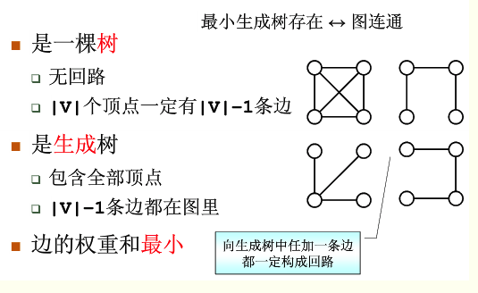

# 图

### 图相关知识
图(`Graph`)是由顶点的有穷非空集合和顶点之间边的集合组成，通常表示为：`G（V，E）`，其中，`G`表示一个图，`V`是图`G`中顶点的集合，`E`是图`G`中边的集合。在图中的数据元素，我们称之为顶点（`Vertex`），顶点集合有穷非空。在图中，任意两个顶点之间都可能有关系，顶点之间的逻辑关系用边来表示，边集可以是空的。

顶点的度(`degree`):就是跟顶点相连接的边的条数。
有向图:边有方向的图。
无向图:边没有方向的图。

顶点的入度(`In-degree`):有多少条边指向这个顶点。
出度(`Out-degree`):表示有多少条边是以这个顶点为起点指向其他顶点。

带权图(`weighted graph`):在带权图中，每条边都有一个权重(`weight`);


稀疏图:有很少条边。
稠密图:有很多条边。

[树-基本术语](https://blog.csdn.net/Ontheroad_/article/details/72739380)

#### 图的存储
##### 邻接矩阵存储方法
图最直观的一种存储方法就是，邻接矩阵(`Adjacency Matrix`)。

邻接矩阵的底层依赖一个二维数组。对于无向图来说，如果顶点`i`与顶点`j`之间有边，我们就将`A[i][j]`和`A[j][i]`标记为`1`;对于有向图来说，如果顶点`i`到顶点`j`之间，有一条箭头从顶点`i`指向顶点`j`的边，那我们就将`A[i][j]`标记为`1`。同理，如果有一条箭头从顶点`j`指向顶点`i`的边，我们就将`A[j][i]`标记为`1`。对于带权图，数组中就存储相应的权重。


优点:
* 简单,直观
* 查询效率高
   * 因为基于数组，所以在获取两个顶点的关系时，就非常高效。
* 方便矩阵运算
   * 用邻接矩阵的方式存储图，可以将很多图的运算**转换成矩阵之间的运算**。比如求解最短路径问题时会提到一个`Floyd-Warshall`算法，就是利用矩阵循环相乘若干次得到结果。

缺点:
* 浪费空间
   * 如果我们存储的是稀疏图(`Sparse Matrix`)，也就是说，顶点很多，但每个顶点的边并不多，那邻接矩阵的存储方法就更加浪费空间。

#### 邻接表存储方法
邻接表(`Adjacency List`):数组与链表相结合的存储方法。


优点:
* 方便查找任意顶点的所有"邻接点"
* 节省存储空间
* 方便计算任意顶点的度
   * 对于无向图:是的
   * 对于有向图:只能计算"出度";需要构造"**逆邻接表**"(存储的边)来方便计算"入度"

缺点:
* 不方便查找

优化:
* 链表换成更加高效的动态数据结构=>比如平衡二叉查找树、跳表、散列表、红黑树等。

小结:
邻接矩阵存储方法的缺点是比较浪费空间，但是优点是查询效率高，而且方便矩阵运算。邻接表存储方法中每个顶点都对应一个链表，存储与其相连接的其他顶点。尽管邻接表的存储方式比较节省存储空间，但链表不方便查找，所以查询效率没有邻接矩阵存储方式高。针对这个问题，邻接表还有改进升级版，即将链表换成更加高效的动态数据结构，比如平衡二叉查找树、跳表、散列表、红黑树等。

#### 图的遍历
图上的搜索算法，最直接的理解就是，在图中找出从一个顶点出发，到另一个顶点的路径。具体方法有很多，比如最简单、最“暴力”的深度优先、广度优先搜索，还有`A*`、`IDA*`等启发式搜索算法。

##### 广度优先搜索(BFS)
广度优先搜索(`Breadth-First-Search`)，我们平常都把简称为`BFS`。直观地讲，它其实就是一种“地毯式”层层推进的搜索策略，即先查找离起始顶点最近的，然后是次近的，依次往外搜索。类似于树的层次遍历。

##### 深度优先搜索(DFS)
深度优先搜索(`Depth-First-Search`)，简称`DFS`。从图中某个顶点v出发，访问此顶点，然后从`v`的未被访问的邻接点出发深度优先遍历图，直至图中所有和`v`有路径相通的顶点都被访问到。

* [图的BFS和DFS之C++实现](https://blog.csdn.net/starstar1992/article/details/68941763)

小结:
广度优先搜索和深度优先搜索是图上的两种最常用、最基本的搜索算法，比起其他高级的搜索算法，比如`A*`、`IDA*`等，要简单粗暴，没有什么优化，所以，也被叫作**暴力搜索算法**。所以，这两种搜索算法仅适用于状态空间不大，也就是说图不大的搜索。
广度优先搜索，通俗的理解就是，地毯式层层推进，从起始顶点开始，依次往外遍历。广度优先搜索需要借助**队列**来实现，遍历得到的路径就是，起始顶点到终止顶点的最短路径。深度优先搜索用的是**回溯思想**，非常适合用**递归**实现。换种说法，深度优先搜索是借助栈来实现的。在执行效率方面，深度优先和广度优先搜索的时间复杂度都是`O(E)`，空间复杂度是`O(V)`。

### 关键路径
之前我们优先关心的是顶点（`AOV`），同样我们也可以优先关心边（同理有`AOE`）。

看看百度百科上解释：
[AOE网](https://baike.baidu.com/item/AOE%E7%BD%91)：`Activity on edge network`
若在带权的有向图中，以顶点表示事件，以有向边表示活动，边上的权值表示活动的开销（如该活动持续的时间），则此带权的有向图称为`AOE`网。

`AOE`一般用来估算工程的完成时间。
`AOE`表示工程的流程，把没有入边的称为始点或者源点，没有出边的顶点称为终点或者汇点。一般情况下，工程只有一个开始，一个结束，

所以正常情况下，`AOE`只有一个源点(始点)一个汇点(终点)。

`AOV`和`AOE`的区别：
1. `AOV`用顶点表示活动的网，描述活动之间的制约关系。
2. `AOE`用边表示活动的网，边上的权值表示活动持续的时间。

`AOE` 是建立在子过程之间的制约关系没有矛盾的基础之上，再来分析整个过程需要的时间。

> 关键路径：**从源点到汇点具有最大长度的路径**。这个概念要清楚，一个工程不一定有一条关键路径，**可能会有多条**。
关键活动：关键路径上的活动（边）。

针对上面`AOE`所关心的问题，要想缩短工程时间，就缩短关键路径上的过程即可。（缩短后可能出现之前的关键路径变成了非关键路径）

* [关键路径的概念和算法](https://www.cnblogs.com/hongyang/p/3407666.html)

### 最小生成树
最小生成树：构造连通网的最小代价生成树。

定义:


#### 普里姆（`prime`）
算法思想:(让一棵小数长大)
> 此算法是将点集合中的点一步步加到树中，在每一步中，都要把一个节点当作根并往上加边，这样也就把相关联的顶点增加到树上了。

第一种：
先将一个起点加入最小生成树，之后不断寻找与最小生成树相连的边权最小的边能通向的点，并将其加入最小生成树，直至所有顶点都在最小生成树中。

第二种：
1. 将一个图的顶点分为两部分，一部分是最小生成树中的结点（A集合），另一部分是未处理的结点（B集合）。
2. 首先选择一个结点，将这个结点加入A中，然后，对集合A中的顶点遍历，找出A中顶点关联的边权值最小的那个（设为v），将此顶点从B中删除，加入集合A中。
3. 递归重复步骤2，直到B集合中的结点为空，结束此过程。
4. A集合中的结点就是由Prime算法得到的最小生成树的结点，依照步骤2的结点连接这些顶点，得到的就是这个图的最小生成树。

时间复杂度:
> Prime算法主要用于边比较多, 点比较少的时候

邻接矩阵:`O(V^2)`
邻接表:`O(E * log2V)`

#### 克鲁斯卡尔（`kluskal`）
算法思想:(将森林合并成树)
> 基本思想：按照权值从小到大的顺序选择n-1条边，并保证这n-1条边不构成回路。
具体做法：首先构造一个只含n个顶点的森林，然后依权值从小到大从连通网中选择边加入到森林中，并使森林中不产生回路，直至森林变成一棵树为止。

在剩下的所有未选取的边中，找最小边，如果和已选取的边构成回路，则放弃，选取次小边。

时间复杂度:`O(E*logE)`
> Kruskal算法主要用于边比较少, 点比较多的时候

* [最小生成树算法【图解】：一文带你理解什么是Prim算法和Kruskal算法](https://www.cnblogs.com/RioTian/p/12698950.html)

### 最短路径
#### 迪杰斯特拉算法(`Dijkstra`)
想要解决这个问题，有一个非常经典的算法，最短路径算法，更加准确地说，是单源最短路径算法(一个顶点到一个顶点)。提到最短路径算法，最出名的莫过于**迪杰斯特拉算法**(`Dijkstra`)算法了。

> 把图中的顶点集合`V`分成两组，第一组为已求出最短路径的顶点集合`S`（初始时`S`中只有源节点，以后每求得一条最短路径，就将它对应的顶点加入到集合`S`中，直到全部顶点都加入到`S`中）；第二组是未确定最短路径的顶点集合`U`。

```
// 因为Java提供的优先级队列，没有暴露更新数据的接口，所以我们需要重新实现一个
private class PriorityQueue { // 根据vertex.dist构建小顶堆
  private Vertex[] nodes;
  private int count;
  public PriorityQueue(int v) {
    this.nodes = new Vertex[v+1];
    this.count = v;
  }
  public Vertex poll() { }
  public void add(Vertex vertex) { }
  // 更新结点的值，并且从下往上堆化，重新符合堆的定义。时间复杂度O(logn)。
  public void update(Vertex vertex) { }
  public boolean isEmpty() { }
}

public void dijkstra(int s, int t) { // 从顶点s到顶点t的最短路径
  int[] predecessor = new int[this.v]; // 用来还原最短路径
  Vertex[] vertexes = new Vertex[this.v];
  for (int i = 0; i < this.v; ++i) {
    vertexes[i] = new Vertex(i, Integer.MAX_VALUE);
  }
  PriorityQueue queue = new PriorityQueue(this.v);// 小顶堆
  boolean[] inqueue = new boolean[this.v]; // 标记是否进入过队列
  vertexes[s].dist = 0;
  queue.add(vertexes[s]);
  inqueue[s] = true;
  while (!queue.isEmpty()) {
    Vertex minVertex= queue.poll(); // 取堆顶元素并删除
    if (minVertex.id == t) break; // 最短路径产生了
    for (int i = 0; i < adj[minVertex.id].size(); ++i) {
      Edge e = adj[minVertex.id].get(i); // 取出一条minVetex相连的边
      Vertex nextVertex = vertexes[e.tid]; // minVertex-->nextVertex
      if (minVertex.dist + e.w < nextVertex.dist) { // 更新next的dist
        nextVertex.dist = minVertex.dist + e.w;
        predecessor[nextVertex.id] = minVertex.id;
        if (inqueue[nextVertex.id] == true) {
          queue.update(nextVertex); // 更新队列中的dist值
        } else {
          queue.add(nextVertex);
          inqueue[nextVertex.id] = true;
        }
      }
    }
  }
  // 输出最短路径
  System.out.print(s);
  print(s, t, predecessor);
}

private void print(int s, int t, int[] predecessor) {
  if (s == t) return;
  print(s, predecessor[t], predecessor);
  System.out.print("->" + t);
}
```
时间复杂度: `O(E*logV)`
堆中的这几个操作，时间复杂度都是`O(logV)`(堆中的元素个数不会超过顶点的个数`V`);

其他方法:
邻接矩阵 `O(n^2)`
邻接表 `O(n^2)`
邻接表+`binary heap` `O((n+m)logn)`
邻接表+`fibonacci heap` `O(m+nlogn)`

核心:
1. 直接扫描未收录的顶点 => 对于稠密图效果好
2. 将`dist`存于最小堆中 => 对于稀疏图效果好

#### 弗洛伊德算法（`Floyd`）
`Dijkstra`算法是经典的求**单源最短路径算法**，当有以下需求时：
* 要求出任意两点间的最短路径；
* 可能有负权边；

用`Floyd`算法(**多源最短路径**：任意两点)，可以在不存在负回路时，求得任意两点间最短路径；存在负回路时，检测出一条负回路。

算法思想:
1. 从任意一条单边路径开始。所有两点之间的距离是边的权，如果两点之间没有边相连，则权为无穷大。
2. 对于每一对顶点 `u` 和 `v`，看看是否存在一个顶点 `w` 使得从 `u` 到 `w` 再到 `v` 比已知的路径更短。如果是更新它。

```
 void Floyd(){
    for(i = 0; i < N; i++)
       for(j = 0; j < N; j++){
         D[i][j] = G[i][j];
         path[i][j] = -1;
       }

    for(k = 0; k < N; k++)
      for(i = 0; i < N; i++)
         for(j = 0; j < N; j++)
            if(D[i][k] + D[k][j] < D[i][j]){
              D[i][j] = D[i][k] + D[k][j];
              path[i][j] = k;
            }
 }
```

时间复杂度:`O(|V|^3)`

### 拓扑排序
> **有向图顶点的线性排序就是其拓扑排序;** 当且仅当图形没有定向循环，即如果它是有向无环图（`DAG`），则拓扑排序是可能的。 任何 `DAG` 具有**至少一个拓扑排序**，并且已知这些算法用于在线性时间内构建任何 `DAG` 的拓扑排序。

在图论中，由一个有向无环图的顶点组成的序列，当且仅当满足下列条件时，称为该图的一个拓扑排序（`Topological sorting`）。
* 每个顶点出现且只出现一次；
* 若存在一条从顶点 `A` 到顶点 `B` 的路径，那么在序列中顶点 `A` 出现在顶点 `B` 的前面。

注:
`DGA`：有向无环图
`AOV`网：数据在顶点 可以理解为面向对象
`AOE`网：数据在边上，可以理解为面向过程

应用:
> 拓扑排序通常用来“排序”具有**依赖关系**的任务。
> 凡是需要通过局部顺序来推导全局顺序的，一般都能用拓扑排序来解决。
除此之外，拓扑排序还能检测图中环的存在。对于`Kahn`算法来说，如果最后输出出来的顶点个数，少于图中顶点个数，图中还有入度不是`0`的顶点，那就说明，图中存在环。

拓扑排序本身就是基于有向无环图的一个算法。有两种实现方法，分别是`Kahn`算法和`DFS`深度优先搜索算法;数据结构定义如下:
```
public class Graph {
  private int v; // 顶点的个数
  private LinkedList<Integer> adj[]; // 邻接表

  public Graph(int v) {
    this.v = v;
    adj = new LinkedList[v];
    for (int i=0; i<v; ++i) {
      adj[i] = new LinkedList<>();
    }
  }

  public void addEdge(int s, int t) { // s先于t，边s->t
    // 存储的并不是完整的二维数组，只存储了连接关系
    adj[s].add(t);
  }
}
```

#### `Kahn`算法(拓扑排序)
**Kahn 算法实际上使用的是贪心算法**。从数据结构中发现，若一个顶点入度为`0`，则没有任何顶点必须先于这个顶点执行，那么这个顶点就可以执行了。

```
public void topoSortByKahn() {
  int[] inDegree = new int[v]; // 统计每个顶点的入度
  for (int i = 0; i < v; ++i) {
    for (int j = 0; j < adj[i].size(); ++j) {
      int w = adj[i].get(j); // i->w
      inDegree[w]++;
    }
  }
  LinkedList<Integer> queue = new LinkedList<>();
  // 统计一开始入度就是0的顶点，添加到队列queue中
  for (int i = 0; i < v; ++i) {
    if (inDegree[i] == 0) queue.add(i);
  }
  while (!queue.isEmpty()) {
    // 依次让入度为0的顶点出队，然后这个顶点可达的顶点入度都减1
    int i = queue.remove();
    System.out.print("->" + i);
    for (int j = 0; j < adj[i].size(); ++j) {
      int k = adj[i].get(j);
      inDegree[k]--;
      // 若这个顶点的入度为0，则添加到队列中
      if (inDegree[k] == 0) queue.add(k);
    }
  }
}
```

#### `DFS`算法(拓扑排序)
之前图上的深度优先搜索只是搜索一个顶点到另一个顶点的路径，而针对这个问题的深度优先遍历，需要遍历图中的所有顶点。对应的代码如下：
```
public void topoSortByDFS() {
  // 先构建逆邻接表，边s->t表示，s依赖于t，t先于s
  LinkedList<Integer> inverseAdj[] = new LinkedList[v];
  for (int i = 0; i < v; ++i) { // 申请空间
    inverseAdj[i] = new LinkedList<>();
  }
  for (int i = 0; i < v; ++i) { // 通过邻接表生成逆邻接表
    for (int j = 0; j < adj[i].size(); ++j) {
      int w = adj[i].get(j); // i->w
      inverseAdj[w].add(i); // w->i
    }
  }
  boolean[] visited = new boolean[v]; // 记录是否遍历过
  for (int i = 0; i < v; ++i) { // 深度优先遍历图
    if (visited[i] == false) {
      visited[i] = true;
      dfs(i, inverseAdj, visited);
    }
  }
}

private void dfs(
    int vertex, LinkedList<Integer> inverseAdj[], boolean[] visited) {
  for (int i = 0; i < inverseAdj[vertex].size(); ++i) {
    int w = inverseAdj[vertex].get(i);
    if (visited[w] == true) continue;
    visited[w] = true;
    dfs(w, inverseAdj, visited);
  } // 先把vertex这个顶点可达的所有顶点都打印出来之后，再打印它自己
  System.out.print("->" + vertex);
}
```

这个算法包含两个关键部分。

第一部分是**通过邻接表构造逆邻接表**。邻接表中，边 `s->t` 表示 `s` 先于 `t`执行；在逆邻接表中，边 `s->t` 表示 `s`后于 `t` 执行。

第二部分是算法的核心，也就是**递归处理每个顶点**。对于顶点 `vertex` 来说，先输出它可达的所有顶点。也就是先把它依赖的所有的顶点输出了，然后再输出自己。

那么，`Kahn` 算法和 `DFS` 算法的时间复杂度分别是多少呢？
* 从 `Kahn` 代码看出，每个顶点被访问了一次，每个边也被访问了一次，所以，`Kahn` 算法的时间复杂度就是 `O(V+E)`（`V` 表示顶点个数，`E` 表示边的个数）。
* `DFS` 算法中，每个顶点被访问两次，每条边都被访问一次，所以时间复杂度也是 `O(V+E)`。
注意，这里的图可能不是连通的，有可能是有好几个不连通的子图构成，所以，`E` 并不一定大于 `V`，两者的大小关系不确定。所以，在表示时间复杂度的时候，`V`、`E` 都要考虑在内。


* [算法：拓扑排序](https://www.cnblogs.com/MrSaver/p/9994720.html)
* [拓扑排序：如何确定代码源文件的编译依赖关系](https://www.zdaiot.com/DataStructureAlgorithm/42%E6%8B%93%E6%89%91%E6%8E%92%E5%BA%8F%EF%BC%9A%E5%A6%82%E4%BD%95%E7%A1%AE%E5%AE%9A%E4%BB%A3%E7%A0%81%E6%BA%90%E6%96%87%E4%BB%B6%E7%9A%84%E7%BC%96%E8%AF%91%E4%BE%9D%E8%B5%96%E5%85%B3%E7%B3%BB/)

附:
* [数据结构---图的详细介绍](https://blog.csdn.net/qq_35644234/article/details/57083107)
* [数据结构之图的一些经典算法](http://blog.sina.com.cn/s/blog_417be8790102wdb1.html)
* [数据结构之图-简述](https://www.cnblogs.com/xiaoxue126/p/9071441.html)
