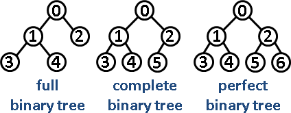

# 树
### 前言
#### 1. 树的定义
　　[树](https://baike.baidu.com/item/%E6%A0%91/2699484?fr=aladdin)是一种数据结构，它是由n（n>=1）个有限结点组成一个具有层次关系的集合。把它叫做“树”是因为它看起来像一棵倒挂的树，也就是说它是根朝上，而叶朝下的。它具有以下的特点：
* 每个结点有零个或多个子结点；
* 没有前驱的结点称为根结点；
* 每一个非根结点有且只有一个父结点；
* 除了根结点外，每个子结点可以分为m个不相交的子树；

#### 2. 基本术语
- **根节点**:最顶层只有一个节点，称之为根节点，root节点。
- **叶子节点**:如果每个节点下方没有任何分叉的话，就是叶子节点。
- **节点的高度**:从某个节点出发，到叶子节点为止，最长简单路径上边的条数，称之为节点的高度。(从下往上度量)
- **节点的深度**:从根节点root出发，到某个节点边的条数，称为该节点的深度。(从上往下度量)


- **叶子**：度为0的节点
- **非终端节点或分支节点**：度不为零的节点；
- **双亲节点或父节点**：若一个结点含有子节点，则这个节点称为其子节点的父节点；
- **孩子节点或子节点**：一个节点含有的子树的根节点称为该节点的子节点；
- **兄弟节点**：具有相同父节点的节点互称为兄弟节点；
- **堂兄弟节点**：双亲在同一层的节点互为堂兄弟；
- **节点的祖先**：从根到该节点所经分支上的所有节点；
- **子孙**：以某节点为根的子树中任一节点都称为该节点的子孙；

#### 3. 树的分类


### 二叉树
#### 1. 定义
二叉树:每个节点至多有两个子节点的树称为二叉树。

**几种特殊的二叉树**
1. **满二叉树**（完美二叉树）：所有非叶子节点均有两个子节点，所有叶子节点必须在同一层上。节点数达到最大值。
2. **完全二叉树**：若设二叉树的深度为`h`，除第`h`层外，其它各层的节点数都达到最大值，第`h`层所有的节点都连续**集中在最左边**。
3. **完满二叉树**：所有非叶子节点的度都是`2`。

完满(`Full`)二叉树 VS 完全(`Complete`)二叉树 VS 完美(`Perfect`)二叉树




**如何存储一颗二叉树**
* 基于指针或者引用的二叉链式存储法
```
struct TreeNode {
    int val;
    TreeNode *left;
    TreeNode *right;
    TreeNode(int x) : val(x), left(NULL), right(NULL) {}
};
```
每个节点有三个字段，其中一个存储数据，另外两个是指向左右子节点的指针。我 们只要拎住根节点，就可以通过左右子节点的指针，把整棵树都串起来。这种存储方式我们比较常用。

* 基于数组的顺序存储法
如果节点X存储在数组中下标为i的位置，下标为`2 * i` 的位置存储的就是左子节点，下标为`2 * i + 1`的位置存储的就是右子节点。反过来，下标 为`i/2`的位置存储就是它的父节点。通过这种方式，我们只要知道根节点存储的位置(一般情况下，为了方便计算子节点，根节点会存储在下标为`1`的位置)，这样就可以通过下标计算，把整棵树都串起来。

完全二叉树仅仅“浪费”了一个下标为`0`的存储位置。如果是非完全二叉树，其实会浪费比较多的数组存储空间。而且堆其实就是一种完全二叉树，最常用的存储方式就是数组。

**二叉树的遍历**
 前序遍历:根节点 => 左子树 => 右子树
 中序遍历:左子树 => 根节点 => 右子树
 后序遍历:左子树 => 右子树 => 根节点

递归实现(时间复杂度是`O(n)`):
```
//前序遍历
void preorderHelper(TreeNode *node){
    if(node == nullptr) return;
    result.push_back(node->val);
    preorderHelper(node->left);
    preorderHelper(node->right);
}

//中序遍历
void inorderHelper(TreeNode *node){
    if(node == nullptr) return;
    inorderHelper(node->left);
    result.push_back(node->val);
    inorderHelper(node->right);
}

//后序遍历
void postorderHelper(TreeNode *node){
    if(node == nullptr) return;
    postorderHelper(node->left);
    postorderHelper(node->right);
    result.push_back(node->val);
}
```

#### 2. 二叉查找树(`Binary Search Tree`)
二叉查找树是二叉树中最常用的一种类型，也叫**二叉搜索树**。顾名思义，二叉查找树是为了实现快速查找而生的。不过，它不仅仅支持快速查找一个数据，还支持快速插入、删除一个数据。

二叉查找树特点:
1. 若左子树不空，则左子树上所有节点的值均小于它的根节点的值；
2. 若右子树不空，则右子树上所有节点的值均大于它的根节点的值；
3. 左、右子树也分别为二叉查找树；

二叉查找树的相关操作:
除了插入、删除、查找操作之外，二叉查找树中还可以支持快速地查找最大节点和最小节点、前驱节点和后继节点。

* [二叉搜索树实现](https://github.com/wangzheng0822/algo/blob/master/c-cpp/24_tree/binarysearchtree.c)

> **中序遍历**二叉查找树，可以**输出有序的数据序列**，时间复杂度是O(n)，非常高效。因此，二叉查找树也叫作二叉排序树。

**支持重复数据的二叉查找树**
* 二叉查找树中每一个节点不仅会存储一个数据，因此我们通过链表和支持动态扩容的数组等数据结构，把值相同的数据都存储在同一个节点上。
* 每个节点仍然只存储一个数据。在查找插入位置的过程中，如果碰到一个节点的值，与要插入数据的值相同，我们就将这个要插入的数据放到这个节点的右子树，也就是说，把这个新插入的数据当作大于这个节点的值来处理。
   *  当要查找数据的时候，遇到值相同的节点，我们并不停止查找操作，而是继续在右子树中查找，直到遇到叶子节点，才停止。这样就可以把键值等于要查找值的所有节点都找出来。删除同理;

**二叉查找树的时间复杂度分析**
如果根节点的左右子树极度不平衡，已经退化成了链表，那么查找的时间复杂度就变成了`O(n)`。
不管操作是插入、删除还是查找，时间复杂度其实都跟树的高度成正比，也就是`O(height)`。

**二叉查找树和散列表对比**
散列表的插入、删除、查找操作的时间复杂度可以做到常量级的`O(1)`，非常高效。而二叉查找树在比较平衡的情况下(平衡二叉查找树)，插入、删除、查找操作时间复杂度才是`O(logn)`，相对散列表，好像并没有什么优势，那为什么还要用二叉查找树呢?
* 第一，散列表中的数据是无序存储的，如果要输出有序的数据，需要先进行排序。而对于二叉查找树来说，我们只需要中序遍历，就可以在`O(n)`的时间复杂度内，输出有序的数据序列。
* 第二，散列表扩容耗时很多，而且当遇到散列冲突时，性能不稳定，尽管二叉查找树的性能不稳定，但是在工程中，我们最常用的平衡二叉查找树的性能非常稳定，时间复杂度稳定在`O(logn)`。
* 第三，笼统地来说，尽管散列表的查找等操作的时间复杂度是常量级的，但因为哈希冲突的存在，这个常量不一定比`logn`小，所以实际的查找速度可能不一定 比`O(logn)`快。加上哈希函数的耗时，也不一定就比平衡二叉查找树的效率高。
* 第四，散列表的构造比二叉查找树要复杂，需要考虑的东西很多。比如散列函数的设计、冲突解决办法、扩容、缩容等。平衡二叉查找树只需要考虑平衡性这一个问题，而且这个问题的解决方案比较成熟、固定。

最后，为了避免过多的散列冲突，散列表装载因子不能太大，特别是基于开放寻址法解决冲突的散列表，不然会浪费一定的存储空间。
综合这几点，平衡二叉查找树在某些方面还是优于散列表的，所以，这两者的存在并不冲突。

#### 3. 平衡二叉查找树
在某些极端情况下，二叉排序树将退化成近似链或链，其操作的时间复杂度将退化成线性的，为了防止这种情况的出现，需要使用某种算法来维持二叉排序树的平衡性，于是便有了平衡二叉树。

**平衡二叉树** 的严格定义是这样的:二叉树中任意一个节点的左右子树的高度相差不能大于`1`，并且左右两棵子树都是一棵平衡二叉树。

##### 常用平衡二叉树
1. `AVL`树

`AVL`树是严格的平衡二叉搜索树，执行插入删除操作时，只要不满足`AVL`树的条件，就要通过旋转来保持平衡。在`AVL`树中任何节点的两棵子树的高度最大差别为`1`，所以AVL树也被称为**高度平衡树**。查找操作很快，但是插入和删除操作可能都需要消耗一定时间用于树旋转。适用于插入删除次数少，查找多的情况。

2. 红黑树

红黑树的英文是“`Red-Black Tree`” 简称`R-B Tree`。它是一种不严格的平衡二叉搜索树，用非严格的平衡来换取增删节点时旋转次数的降低，任何不平衡都会在三次旋转之内解决。查询性能略逊于`AVL`树，但增删操作比`AVL`树强很多，应用场景更多。

那么红黑树是怎么定义的呢?
顾名思义，红黑树中的节点，一类被标记为黑色，一类被标记为红色。除此之外，一棵红黑树还需要满足这样几个要求:
* 根节点是黑色的;
* 每个叶子节点都是黑色的空节点(NIL)，也就是说，叶子节点不存储数据;
* 任何相邻的节点都不能同时为红色，也就是说，红色节点是被黑色节点隔开的;
* 每个节点，从该节点到达其可达叶子节点的所有路径，都包含相同数目的黑色节点;

在插入、删除节点的过程中，第三、第四点要求可能会被破坏，这时候就需要“**平衡调整**”，实际上就是要把被破坏的第三、第四点恢复过来。 这里介绍两个非常重要的操作，**左旋**(`rotate left`)、**右旋**(`rotate right`)。左旋全称其实是叫围绕某个节点的左旋，那右旋的全称就叫围绕某个节点的右旋。


**时间复杂度分析**
二叉查找树很多操作的**性能都跟树的高度成正比**。一棵极其平衡的二叉树(满二叉树或完全二叉树)的高度大约是`log2n`;
红黑树的高度只比高度平衡的`AVL`树的高度(`log2n`)仅仅大了一倍，在性能上，下降得并不多，实际上红黑树的性能更好。

小结:
红黑树是一种平衡二叉查找树。它是为了解决普通二叉查找树在数据更新的过程中，复杂度退化的问题而产生的。红黑树的高度近似`log2n`，所以它是近似平衡， 插入、删除、查找操作的时间复杂度都是`O(logn)`。

### 多路查找树
#### B树
`B`树也称`B-`树,`B-`树直接读作`B`树，不能因为有“`-`”号就读作`B`减树，它是一颗多路平衡查找树。我们描述一颗`B`树时需要指定它的阶数，阶数表示了一个结点最多有多少个孩子结点，一般用字母`m`表示阶数。当`m`取`2`时，就是我们常见的二叉搜索树，`m`为`3`时是`2-3`树。

**时间复杂度分析**
`B`树的删除操作同样需要执行查找过程，时间复杂度为`O(mlogmn)`。删除数据过程与插入过程类似，最坏情况需要回溯`O(h)`。因此`B`树的删除操作的时间复杂度近似为`O(mlogmn)`。

小结:
`B`树是一种**平衡的多路查找树**。其设计思路主要是通过节点中存储不止一个`key`，来降低树的高度。同等比较次数下，树的高度小保证磁盘`IO`次数相对较少，提高查找效率。

#### B+树
B+树是B-树的一种变体，B+树相比B-树的特点：
1. 索引节点的key值均会出现在叶子节点中。
2. 索引节点中的key值在叶子节点中或者为最大值或者为最小值。
3. 叶子节点使用单链表的形式链接起来。

特点:
* 每个节点中子节点的个数不能超过`m`，也不能小于`m/2`;
* 根节点的子节点个数可以不超过`m/2`，这是一个例外;
* `m`叉树只存储索引，并不真正存储数据，这个有点儿类似跳表; 通过链表将叶子节点串联在一起，这样可以方便按区间查找;
* 一般情况，根节点会被存储在内存中，其他节点存储在磁盘中。

> `B`树/`B+`树主要用于磁盘文件组织 数据索引和数据库索引等场景。

而`B`树实际上是低级版的`B+`树，或者说`B+`树是`B`树的改进版。`B`树跟`B+`树的不同点主要集中在这几个地方:
* `B+`树中的节点不存储数据，只是索引，而`B`树中的节点存储数据;
* `B`树中的叶子节点并不需要链表来串联。
也就是说，`B`树只是一个每个节点的子节点个数不能小于`m/2`的`m`叉树。

#### 哈夫曼树(Huffman Tree)
给定N个权值作为N个叶子结点，构造一棵二叉树，若该树的带权路径长度达到最小，称这样的二叉树为最优二叉树，也称为[哈夫曼树](https://baike.baidu.com/item/%E5%93%88%E5%A4%AB%E6%9B%BC%E6%A0%91/2305769?fr=aladdin)(`Huffman Tree`)。哈夫曼树是带权路径长度最短的树，权值较大的结点离根较近。

> 霍夫曼树主要用于霍夫曼编码，进行数据压缩领域。

* [哈夫曼树学习](https://www.cnblogs.com/ys-ys/p/11221217.html)
* [植树节，程序猿种的那些树](https://mp.weixin.qq.com/s?__biz=MzUyNjQxNjYyMg==&mid=2247484944&idx=1&sn=33e3496681854c0e55e59e900949a7a0&chksm=fa0e6991cd79e08777c28499abc1a231e8e52b50d72eb332cecbe3e9bff4add38ef715d85d54&scene=21#wechat_redirect)

#### 2-3树
性质:
1. 对于每一个结点有 `1` 或者 `2` 个关键码。
2. 当节点有一个关键码的时，节点有 `2` 个子树。
3. 当节点有 `2` 个关键码时，节点有 `3` 个子树。
4. 所有叶子点都在树的同一层。


* [2-3树](https://mp.weixin.qq.com/s?__biz=MzUyNjQxNjYyMg==&mid=2247484676&idx=1&sn=95da6d2ab65302da195a75bc3122ea3b&chksm=fa0e6a85cd79e3936b6280a3f946dfd50fde3e46cfccd68f8dff2568d6dbb9c0e4b185f007e7&scene=21#wechat_redirect)

#### 2-3-4树
性质:
1. 每个节点每个节点有 `1`、`2` 或 `3` 个 `key` ，分别称为 `2-`节点，`3-`节点，`4-` 节点。
2. 所有叶子节点到根节点的长度一致（也就是说叶子节点都在同一层）。
3. 每个节点的 `key` 从左到右保持了从小到大的顺序，两个 `key` 之间的子树中所有的 `key` 一定大于它的父节点的左 `key` ，小于父节点的右 `key`。


* [2-3-4树](https://mp.weixin.qq.com/s?__biz=MzUyNjQxNjYyMg==&mid=2247484706&idx=1&sn=645713dba123f71a014dcc1204083293&chksm=fa0e6aa3cd79e3b5b2ebf903a52bd90f6728e9def50da80eb0ee5aa3aa9f6e940c9822217fe2&scene=21#wechat_redirect)

### 堆
#### 1. 定义
* 堆是一个**完全二叉树**;
* 堆中每一个节点的值都必须大于等于(或小于等于)其子树中每个节点的值。
   * 对于每个节点的值都大于等于子树中每个节点值的堆，我们叫作“**大顶堆**”。对于每个节点的值都小于等于子树中每个节点值的堆，我们叫作“**小顶堆**”。

如何实现一个堆?
堆是完全二叉树比较适合用数组来存储，非常节省存储空间的。
1. 往堆中插入一个元素
此时不满足堆的特性, 就需要进行调整, 这个过程被叫做**堆化**;
堆化实际上有两种，从下往上和从上往下。
如果不满足子节点小于等于父节点的大小关系，我们就互换两个节点。一直重复这个过程，直到父子节点之间满足刚说的那种大小关系。

```
public class Heap {
  private int[] a; // 数组，从下标1开始存储数据
  private int n; // 堆可以存储的最大数据个数
  private int count; // 堆中已经存储的数据个数
  public Heap(int capacity) {
    a = new int[capacity + 1];
    n = capacity;
    count = 0;
  }

  public void insert(int data) {
      if (count >= n) return; // 堆满了
      ++count;
      a[count] = data;
      int i = count;
      while (i/2 > 0 && a[i] > a[i/2]) { // 自下往上堆化
        swap(a, i, i/2); // swap()函数作用:交换下标为i和i/2的两个元素
        i = i/2;
    }
  }
}
```

2. 删除堆顶元素

```
public void removeMax() {
    if (count == 0) return -1; // 堆中没有数据
    a[1] = a[count];
    --count;
    heapify(a, count, 1);
}

private void heapify(int[] a, int n, int i) { // 自上往下堆化
    while (true) {
        int maxPos = i;
        if (i*2 <= n && a[i] < a[i*2]) maxPos = i*2;
        if (i*2+1 <= n && a[maxPos] < a[i*2+1]) maxPos = i*2+1;
        if (maxPos == i) break;
        swap(a, i, maxPos);
        i = maxPos;
    }
}
```

> 堆中插入一个元素和删除堆顶元素的时间复杂度都是`O(logn)`。

#### 2. 堆排序
堆排序的过程大致分解成两个大的步骤，**建堆**和**排序**。
1. 建堆
首先将数组原地建成一个堆。所谓“原地”就是，不借助另一个数组，就在原数组上操作。

```
private static void buildHeap(int[] a, int n) {
    for (int i = n/2; i >= 1; --i) {
    heapify(a, n, i);
}}
private static void heapify(int[] a, int n, int i) {
    while (true) {
        int maxPos = i;
        if (i*2 <= n && a[i] < a[i*2]) maxPos = i*2;
        if (i*2+1 <= n && a[maxPos] < a[i*2+1]) maxPos = i*2+1;
        if (maxPos == i) break;
        swap(a, i, maxPos);
        i = maxPos;
    }
}
```

2. 排序

```
// n表示数据的个数，数组a中的数据从下标1到n的位置。
public static void sort(int[] a, int n) {
  buildHeap(a, n);
  int k = n;
  while (k > 1) {
    swap(a, 1, k);
    --k;
    heapify(a, k, 1);
  }
}
```

堆排序的时间复杂度、空间复杂度以及稳定性:
整个堆排序的过程，都只需要极个别临时存储空间，所以堆排序是原地排序算法。堆排序包括建堆和排序两个操作，建堆过程的时间复杂度是`O(n)`，排序过程的时间复杂度是`O(nlogn)`，所以，堆排序整体的时间复杂度是`O(nlogn)`。

**堆排序不是稳定的排序算法**，因为在排序的过程，存在将堆的最后一个节点跟堆顶节点互换的操作，所以就有可能改变值相同数据的原始相对顺序。

注:
如果节点的下标是`i`，那左子节点的下标就是`2*i+1`，右子节点的下标就是`2*i+2`，父节点的下标就是`i/2 + 1`。

**为什么快速排序要比堆排序性能好?**
* 第一点，堆排序**数据访问的方式**没有快速排序友好。
对于快速排序来说，数据是顺序访问的。而对于堆排序来说，数据是跳着访问的。
* 第二点，对于同样的数据，在排序过程中，堆排序算法的**数据交换次数**要多于快速排序。


#### 3. 堆的应用
##### 优先级队列
在优先级队列中，数据的出队顺序不是先进先出，而是按照优先级来，优先级最高的，最先出队。

1. 合并有序小文件

将从小文件中取出来的字符串放入到小顶堆中，那堆顶的元素，也就是优先级队列队首的元素，就是最小的字符串。我们将这个字符串放入到大文件中，并将其从堆中删除。然后再从小文件中取出下一个字符串，放入到堆中。循环这个过程，就可以将多个小文件中的数 据依次放入到大文件中。
删除堆顶数据和往堆中插入数据的时间复杂度都是O(logn)，n表示堆中的数据个数，这样是不是就比数组存储方式的效率要高了呢。

2. 高性能定时器

按照任务设定的执行时间，将这些任务存储在优先级队列中，队列首部(也就是小顶堆的堆顶)存储的是最先执行的任务。这样，定时器就不需要每隔1秒就扫描一遍任务列表了。

##### 利用堆求TopK
求`TopK`的问题抽象成两类。
* 一类是针对静态数据集合，也就是说数据集合事先确定，不会再变。
* 另一类是针对动态数据集合，也就是说数据集合事先并不确定，有数据动态地加入到集合中。

##### 利用堆求中位数
维护两个堆，一个大顶堆，一个小顶堆。大顶堆中存储前半部分数据，小顶堆中存储后半部分数据，且小顶堆中的数据都大于大顶堆中的数据。

```
//复杂度分析
时间复杂度：O(logn)。堆插入和删除需要 O(logn)，查找中位数需要 O(1)
空间复杂度：O(n)

class MedianFinder {
    priority_queue<int> lo;                              // 大顶堆
    priority_queue<int, vector<int>, greater<int>> hi;   // 小顶堆

public:
    void addNum(int num)
    {
        lo.push(num);                                    // 加到大顶堆

        hi.push(lo.top());                               // 平衡
        lo.pop();

        if (lo.size() < hi.size()) {                     // 维护两个堆元素个数
            lo.push(hi.top());
            hi.pop();
        }
    }

    // Returns the median of current data stream
    double findMedian()
    {
         return large.size() == small.size() ? (large.top() + small.top()) / 2.0 : (double)large.top();
    }
};
```

小结:
优先级队列是一种特殊的队列，优先级高的数据先出队，而不再像普通的队列那样，先进先出。实际上，堆就可以看作优先级队列，只是称谓不一样罢了。求`TopK`问题又可以分为针对静态数据和针对动态数据，只需要利用一个堆，就可以做到非常高效率的查询`TopK`的数据。求中位数实际上还有很多变形，比如求99百分位数据、90百分位数据等，处理的思路都是一样的，即利用两个堆，一个大顶堆，一个小顶堆，随着数据的动态添加，动态调整两个堆中的数据，最后大顶堆的堆顶元素就是要求的数据。
