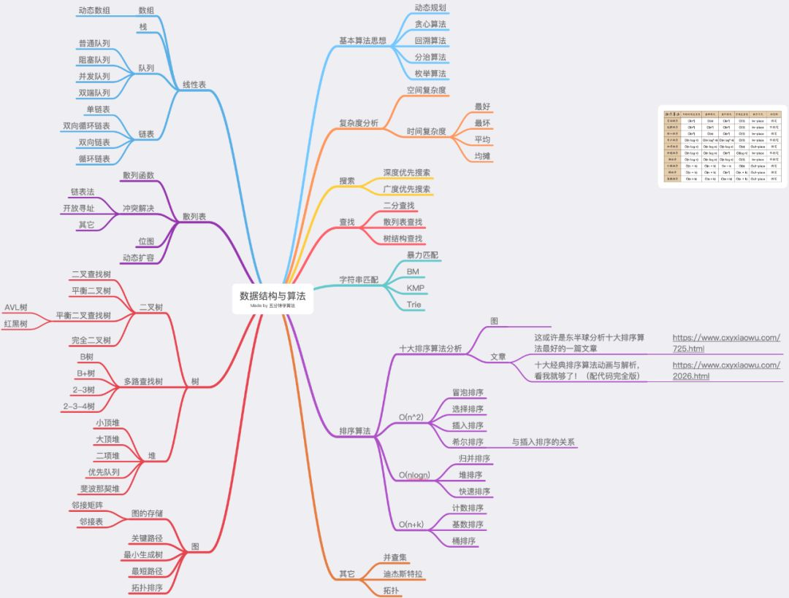

# 算法面试收藏

### BLOG
#### 知识梳理
* [算法与数据结构文章详细分类与整理](https://mp.weixin.qq.com/s/5t_GlQife425JqBMs4aNew)
* [常见算法面试题-概念](https://www.cnblogs.com/haoxinchen/p/11186417.html)
* [值得收藏的十大经典排序算法](https://www.jianshu.com/p/0186aaf71d78)
* [常用算法复杂度速查表](https://mp.weixin.qq.com/s/-eJk3cjNssGtiJv9FAqMXw)
* [数据结构可视化(Data Structure Visualizations)](https://www.cs.usfca.edu/~galles/visualization/Algorithms.html)

#### 面试相关
* [互联网公司最常见的面试算法题有哪些？](https://www.zhihu.com/question/24964987)
* [面试高级算法梳理笔记](https://www.jianshu.com/p/247bfc27ab57)

### IMG
1. 算法知识结构

2. 算法知识体系图

### PDF
* [算法知识图谱1](../Resources/算法知识图谱1.pdf)
* [算法知识图谱2](../Resources/算法知识图谱2.pdf)
