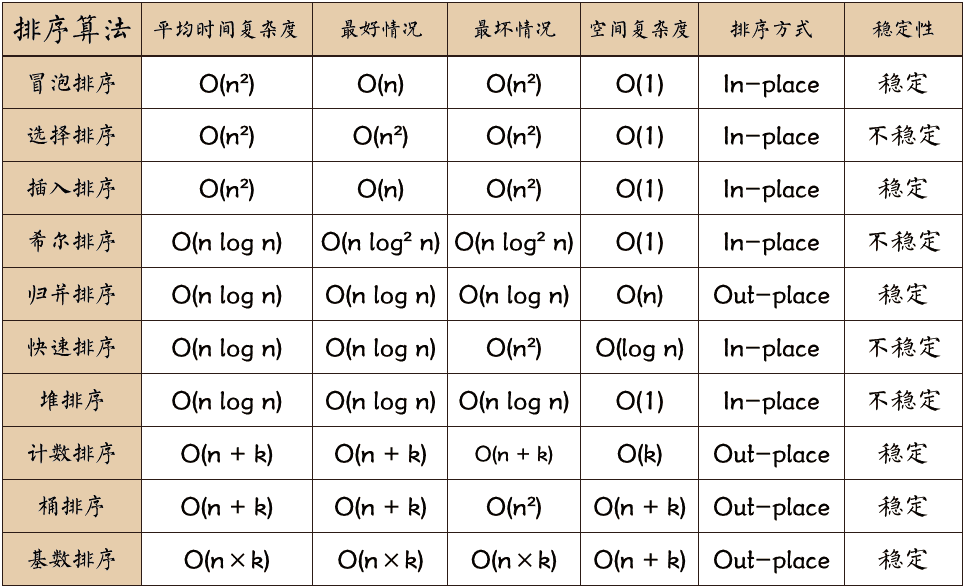
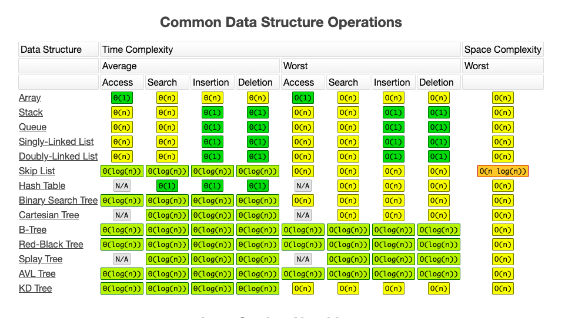

# AlgorithmicPractice

本篇是关于`LeetCode`算法练习的总结(题目主要来源于**剑指offer**)，内容划分为以下章节：

***注:***  
***`main.cpp`展示测试效果;***

### 一.基础数据结构
#### 1.1 字符串
序号  | 题目(解答链接) |  LeetCode(原题链接)
:-:|:-:|:-:
1|[Implement strStr()](https://github.com/binzi56/AlgorithmicPractice/tree/master/AlgorithmicPractice/AlgorithmicPractice/Demo1/String/Demo1_1_1)|   [实现 strStr()](https://leetcode-cn.com/problems/implement-strstr/)
2|[Reverse String](https://github.com/binzi56/AlgorithmicPractice/tree/master/AlgorithmicPractice/AlgorithmicPractice/Demo1/String/Demo1_1_2)|[反转字符串](https://leetcode-cn.com/problems/reverse-string/)
3|[Reverse Words in a String](https://github.com/binzi56/AlgorithmicPractice/tree/master/AlgorithmicPractice/AlgorithmicPractice/Demo1/String/Demo1_1_3)|[翻转字符串里的单词](https://leetcode-cn.com/problems/reverse-words-in-a-string/)
4|[String to Integer (atoi)](https://github.com/binzi56/AlgorithmicPractice/tree/master/AlgorithmicPractice/AlgorithmicPractice/Demo1/String/Demo1_1_4)|[字符串转换整数 (atoi)](https://leetcode-cn.com/problems/string-to-integer-atoi/)
5|[First Unique Character in a String](https://github.com/binzi56/AlgorithmicPractice/tree/master/AlgorithmicPractice/AlgorithmicPractice/Demo1/String/Demo1_1_5)|[字符串中的第一个唯一字符](https://leetcode-cn.com/problems/first-unique-character-in-a-string/)
6|[Add Binary](https://github.com/binzi56/AlgorithmicPractice/tree/master/AlgorithmicPractice/AlgorithmicPractice/Demo1/String/Demo1_1_6)|[二进制求和](https://leetcode-cn.com/problems/add-binary/)
7|[Longest Substring Without Repeating Characters](https://github.com/binzi56/AlgorithmicPractice/tree/master/AlgorithmicPractice/AlgorithmicPractice/Demo1/String/Demo1_1_7)|[无重复字符的最长子串](https://leetcode-cn.com/problems/longest-substring-without-repeating-characters/)
8|[II. Left rotate string](https://github.com/binzi56/AlgorithmicPractice/tree/master/AlgorithmicPractice/AlgorithmicPractice/Demo1/String/Demo1_1_8)|[II. 左旋转字符串](https://leetcode-cn.com/problems/zuo-xuan-zhuan-zi-fu-chuan-lcof/)
9|[Rotate String](./AlgorithmicPractice/AlgorithmicPractice/Demo1/String/Demo1_1_9)|[旋转字符串](https://leetcode-cn.com/problems/rotate-string/)
10|[Replace spaces](./AlgorithmicPractice/AlgorithmicPractice/Demo1/String/Demo1_1_10)|[替换空格](https://leetcode-cn.com/problems/ti-huan-kong-ge-lcof/)

#### 1.2 数组
序号  | 题目(解答链接) |  LeetCode(原题链接)
:-:|:-:|:-:
1|[Remove Duplicates from Sorted Array](https://github.com/binzi56/AlgorithmicPractice/tree/master/AlgorithmicPractice/AlgorithmicPractice/Demo1/Array/Demo1_2_1)|[删除排序数组中的重复项](https://leetcode-cn.com/problems/remove-duplicates-from-sorted-array/)
2|[Median of Two Sorted Arrays](https://github.com/binzi56/AlgorithmicPractice/tree/master/AlgorithmicPractice/AlgorithmicPractice/Demo1/Array/Demo1_2_2)|[寻找两个正序数组的中位数](https://leetcode-cn.com/problems/median-of-two-sorted-arrays/)
3|[Merge Sorted Array](https://github.com/binzi56/AlgorithmicPractice/tree/master/AlgorithmicPractice/AlgorithmicPractice/Demo1/Array/Demo1_2_3)|[合并两个有序数组](https://leetcode-cn.com/problems/merge-sorted-array/)
4|[3sum](https://github.com/binzi56/AlgorithmicPractice/tree/master/AlgorithmicPractice/AlgorithmicPractice/Demo1/Array/Demo1_2_4)|[三数之和](https://leetcode-cn.com/problems/3sum/)
5|[Majority Element](https://github.com/binzi56/AlgorithmicPractice/tree/master/AlgorithmicPractice/AlgorithmicPractice/Demo1/Array/Demo1_2_5)|[多数元素](https://leetcode-cn.com/problems/majority-element/)
6|[Search A 2d Matrix Ⅱ](https://github.com/binzi56/AlgorithmicPractice/tree/master/AlgorithmicPractice/AlgorithmicPractice/Demo1/Array/Demo1_2_6)|[搜索二维矩阵 II](https://leetcode-cn.com/problems/search-a-2d-matrix-ii/)
7|[Find First And Last Position Of Element In Sorted Array](https://github.com/binzi56/AlgorithmicPractice/tree/master/AlgorithmicPractice/AlgorithmicPractice/Demo1/Array/Demo1_2_7)|[在排序数组中查找元素的第一个和最后一个位置](https://leetcode-cn.com/problems/find-first-and-last-position-of-element-in-sorted-array/)
8|[Spiral Matrix](https://github.com/binzi56/AlgorithmicPractice/tree/master/AlgorithmicPractice/AlgorithmicPractice/Demo1/Array/Demo1_2_8)|[螺旋矩阵](https://leetcode-cn.com/problems/spiral-matrix/)

### 二.链表
序号  | 题目(解答链接) |  LeetCode(原题链接)
:-:|:-:|:-:
1|[Reverse Linked List](https://github.com/binzi56/AlgorithmicPractice/tree/master/AlgorithmicPractice/AlgorithmicPractice/Demo2/Demo2_1)|[反转链表](https://leetcode-cn.com/problems/reverse-linked-list/)
2|[Add Two Numbers](https://github.com/binzi56/AlgorithmicPractice/tree/master/AlgorithmicPractice/AlgorithmicPractice/Demo2/Demo2_2)|[两数相加](https://leetcode-cn.com/problems/add-two-numbers/)
3|[Linked List Cycle](https://github.com/binzi56/AlgorithmicPractice/tree/master/AlgorithmicPractice/AlgorithmicPractice/Demo2/Demo2_3)|[环形链表](https://leetcode-cn.com/problems/linked-list-cycle/)
4|[Merge Two Sorted Lists](https://github.com/binzi56/AlgorithmicPractice/tree/master/AlgorithmicPractice/AlgorithmicPractice/Demo2/Demo2_4)|[合并两个有序链表](https://leetcode-cn.com/problems/merge-two-sorted-lists/)
5|[Remove Nth Node From End of List](https://github.com/binzi56/AlgorithmicPractice/tree/master/AlgorithmicPractice/AlgorithmicPractice/Demo2/Demo2_5)|[删除链表的倒数第N个节点](https://leetcode-cn.com/problems/remove-nth-node-from-end-of-list/)
6|[Middle of the Linked List](https://github.com/binzi56/AlgorithmicPractice/tree/master/AlgorithmicPractice/AlgorithmicPractice/Demo2/Demo2_6)|[链表的中间结点](https://leetcode-cn.com/problems/middle-of-the-linked-list/)
7|[Design Linked List](https://github.com/binzi56/AlgorithmicPractice/tree/master/AlgorithmicPractice/AlgorithmicPractice/Demo2/Demo2_7)|[设计链表](https://leetcode-cn.com/problems/design-linked-list/)
8|[Delete The Node Of The Linked List](https://github.com/binzi56/AlgorithmicPractice/tree/master/AlgorithmicPractice/AlgorithmicPractice/Demo2/Demo2_8)|[删除链表的节点](https://leetcode-cn.com/problems/shan-chu-lian-biao-de-jie-dian-lcof/)
9|[The K-th Last Node In The Linked List](https://github.com/binzi56/AlgorithmicPractice/tree/master/AlgorithmicPractice/AlgorithmicPractice/Demo2/Demo2_9)|[链表中倒数第k个节点](https://leetcode-cn.com/problems/lian-biao-zhong-dao-shu-di-kge-jie-dian-lcof/)
10|[Intersection Of Two Linked Lists](https://github.com/binzi56/AlgorithmicPractice/tree/master/AlgorithmicPractice/AlgorithmicPractice/Demo2/Demo2_10)|[相交链表](https://leetcode-cn.com/problems/liang-ge-lian-biao-de-di-yi-ge-gong-gong-jie-dian-lcof/)
11|[Copy List With Random Pointer](https://github.com/binzi56/AlgorithmicPractice/tree/master/AlgorithmicPractice/AlgorithmicPractice/Demo2/Demo2_11)|[复制带随机指针的链表](https://leetcode-cn.com/problems/copy-list-with-random-pointer/)

### 三.栈和队列
序号  | 题目(解答链接) |  LeetCode(原题链接)
:-:|:-:|:-:
1|[Valid Parentheses](https://github.com/binzi56/AlgorithmicPractice/tree/master/AlgorithmicPractice/AlgorithmicPractice/Demo3/Demo3_1)|[有效的括号](https://leetcode-cn.com/problems/valid-parentheses/)
2|[Longest Valid Parentheses](https://github.com/binzi56/AlgorithmicPractice/tree/master/AlgorithmicPractice/AlgorithmicPractice/Demo3/Demo3_2)|[最长有效括号](https://leetcode-cn.com/problems/longest-valid-parentheses/)
3|[Evaluate Reverse Polish Notation](https://github.com/binzi56/AlgorithmicPractice/tree/master/AlgorithmicPractice/AlgorithmicPractice/Demo3/Demo3_3)|[逆波兰表达式求值](https://leetcode-cn.com/problems/evaluate-reverse-polish-notation/)
4|[Design Circular Deque](https://github.com/binzi56/AlgorithmicPractice/tree/master/AlgorithmicPractice/AlgorithmicPractice/Demo3/Demo3_4)|[设计循环双端队列](https://leetcode-cn.com/problems/design-circular-deque/)
5|[Implement queue with two stacks](https://github.com/binzi56/AlgorithmicPractice/tree/master/AlgorithmicPractice/AlgorithmicPractice/Demo3/Demo3_5)|[用两个栈实现队列](https://leetcode-cn.com/problems/yong-liang-ge-zhan-shi-xian-dui-lie-lcof/)
6|[Min Stack](./AlgorithmicPractice/AlgorithmicPractice/Demo3/Demo3_6)|[最小栈](https://leetcode-cn.com/problems/min-stack/)
7|[Validate Stack Sequences](./AlgorithmicPractice/AlgorithmicPractice/Demo3/Demo3_7)|[验证栈序列](https://leetcode-cn.com/problems/validate-stack-sequences/)

### 四.二叉树
序号  | 题目(解答链接) |  LeetCode(原题链接)
:-:|:-:|:-:
1|[Maximum Depth of Binary Tree](https://github.com/binzi56/AlgorithmicPractice/tree/master/AlgorithmicPractice/AlgorithmicPractice/Demo4/Demo4_1)|[二叉树的最大深度](https://leetcode-cn.com/problems/maximum-depth-of-binary-tree/)
2|[Invert Binary Tree](https://github.com/binzi56/AlgorithmicPractice/tree/master/AlgorithmicPractice/AlgorithmicPractice/Demo4/Demo4_2)|[翻转二叉树](https://leetcode-cn.com/problems/invert-binary-tree/)
3|[Balanced Binary Tree](https://github.com/binzi56/AlgorithmicPractice/tree/master/AlgorithmicPractice/AlgorithmicPractice/Demo4/Demo4_3)|[平衡二叉树](https://leetcode-cn.com/problems/balanced-binary-tree/)
4|[Symmetric Tree](https://github.com/binzi56/AlgorithmicPractice/tree/master/AlgorithmicPractice/AlgorithmicPractice/Demo4/Demo4_4)|[对称二叉树](https://leetcode-cn.com/problems/symmetric-tree/)
5|[Same Tree](https://github.com/binzi56/AlgorithmicPractice/tree/master/AlgorithmicPractice/AlgorithmicPractice/Demo4/Demo4_5)|[相同的树](https://leetcode-cn.com/problems/same-tree/)
6|[Binary Tree Preorder Traversal](https://github.com/binzi56/AlgorithmicPractice/tree/master/AlgorithmicPractice/AlgorithmicPractice/Demo4/Demo4_6)|[二叉树的前序遍历](https://leetcode-cn.com/problems/binary-tree-preorder-traversal/)
7|[Binary Tree Inorder Traversal](https://github.com/binzi56/AlgorithmicPractice/tree/master/AlgorithmicPractice/AlgorithmicPractice/Demo4/Demo4_6)|[二叉树的中序遍历](https://leetcode-cn.com/problems/binary-tree-inorder-traversal/)
8|[Binary Tree Postorder Traversal](https://github.com/binzi56/AlgorithmicPractice/tree/master/AlgorithmicPractice/AlgorithmicPractice/Demo4/Demo4_6)|[二叉树的后序遍历](https://leetcode-cn.com/problems/binary-tree-postorder-traversal/)
9|[Binary Tree Level Order Traversal II](https://github.com/binzi56/AlgorithmicPractice/tree/master/AlgorithmicPractice/AlgorithmicPractice/Demo4/Demo4_7)|[二叉树的层次遍历](https://leetcode-cn.com/problems/binary-tree-level-order-traversal-ii/)
10|[Balidate Binary Search Tree](https://github.com/binzi56/AlgorithmicPractice/tree/master/AlgorithmicPractice/AlgorithmicPractice/Demo4/Demo4_8)|[验证二叉搜索树(BST)](https://leetcode-cn.com/problems/validate-binary-search-tree/)
11|[Path Sum](https://github.com/binzi56/AlgorithmicPractice/tree/master/AlgorithmicPractice/AlgorithmicPractice/Demo4/Demo4_9)|[路径总和](https://leetcode-cn.com/problems/path-sum/)
12|[Path Sum II](./AlgorithmicPractice/AlgorithmicPractice/Demo4/Demo4_10)|[路径总和 II](https://leetcode-cn.com/problems/path-sum-ii/)
13|[Tree substructure](./AlgorithmicPractice/AlgorithmicPractice/Demo4/Demo4_11)|[树的子结构](https://leetcode-cn.com/problems/shu-de-zi-jie-gou-lcof/)
14|[Lowest Common Ancestor Of A Binary Tree](./AlgorithmicPractice/AlgorithmicPractice/Demo4/Demo4_12)|[二叉树的最近公共祖先](https://leetcode-cn.com/problems/lowest-common-ancestor-of-a-binary-tree/)
15|[The k-th largest node of the binary search tree](./AlgorithmicPractice/AlgorithmicPractice/Demo4/Demo4_13)|[二叉搜索树的第k大节点](https://leetcode-cn.com/problems/er-cha-sou-suo-shu-de-di-kda-jie-dian-lcof/)
16|[Serialize And Deserialize Binary Tree](./AlgorithmicPractice/AlgorithmicPractice/Demo4/Demo4_14)|[二叉树的序列化与反序列化](https://leetcode-cn.com/problems/serialize-and-deserialize-binary-tree/)
17|[Postorder traversal sequence of binary search tree](./AlgorithmicPractice/AlgorithmicPractice/Demo4/Demo4_15)|[二叉搜索树的后序遍历序列](https://leetcode-cn.com/problems/er-cha-sou-suo-shu-de-hou-xu-bian-li-xu-lie-lcof/)

### 五.排序
#### 5.1 排序
序号  | 题目(解答链接) |  LeetCode(原题链接)
:-:|:-:|:-:
1|[Kth Largest Element in an Array](https://github.com/binzi56/AlgorithmicPractice/tree/master/AlgorithmicPractice/AlgorithmicPractice/Demo5/Demo5_3)|[数组中的第K个最大元素](https://leetcode-cn.com/problems/kth-largest-element-in-an-array/)
2|[Sort List](./AlgorithmicPractice/AlgorithmicPractice/Demo5/Demo5_1)|[排序链表](https://leetcode-cn.com/problems/sort-list/)
3|[Reverse pair in array](./AlgorithmicPractice/AlgorithmicPractice/Demo5/Demo5_5)|[数组中的逆序对](https://leetcode-cn.com/problems/shu-zu-zhong-de-ni-xu-dui-lcof/)

#### [5.2 排序算法](https://github.com/binzi56/AlgorithmicPractice/tree/master/AlgorithmicPractice/AlgorithmicPractice/Demo5/Demo5_2)
序号  | 排序(示例链接)
:-:|:-:
1|[冒泡排序](https://github.com/binzi56/AlgorithmicPractice/tree/master/AlgorithmicPractice/AlgorithmicPractice/Demo5/Demo5_2/Demo5_2_1)
2|[选择排序](https://github.com/binzi56/AlgorithmicPractice/tree/master/AlgorithmicPractice/AlgorithmicPractice/Demo5/Demo5_2/Demo5_2_2)
3|[插入排序](https://github.com/binzi56/AlgorithmicPractice/tree/master/AlgorithmicPractice/AlgorithmicPractice/Demo5/Demo5_2/Demo5_2_3)
4|[希尔排序](https://github.com/binzi56/AlgorithmicPractice/tree/master/AlgorithmicPractice/AlgorithmicPractice/Demo5/Demo5_2/Demo5_2_4)
5|[快速排序](https://github.com/binzi56/AlgorithmicPractice/tree/master/AlgorithmicPractice/AlgorithmicPractice/Demo5/Demo5_2/Demo5_2_5)
6|[归并排序](https://github.com/binzi56/AlgorithmicPractice/tree/master/AlgorithmicPractice/AlgorithmicPractice/Demo5/Demo5_2/Demo5_2_6)
7|[堆排序](https://github.com/binzi56/AlgorithmicPractice/tree/master/AlgorithmicPractice/AlgorithmicPractice/Demo5/Demo5_2/Demo5_2_7)

### 六.二分查找
序号  | 题目(解答链接) |  LeetCode(原题链接)
:-:|:-:|:-:
1|[Sqrt(x)](https://github.com/binzi56/AlgorithmicPractice/tree/master/AlgorithmicPractice/AlgorithmicPractice/Demo6/Demo6_1)|[x 的平方根](https://leetcode-cn.com/problems/sqrtx/)
2|[Numbers missing from 0 to n-1](./AlgorithmicPractice/AlgorithmicPractice/Demo6/Demo6_2)|[0～n-1中缺失的数字](https://leetcode-cn.com/problems/que-shi-de-shu-zi-lcof/)
3|[Find Minimum In Rotated Sorted Array](./AlgorithmicPractice/AlgorithmicPractice/Demo6/Demo6_3)|[寻找旋转排序数组中的最小值](https://leetcode-cn.com/problems/find-minimum-in-rotated-sorted-array/description/)
4|[Find First and Last Position of Element in Sorted Array](./AlgorithmicPractice/AlgorithmicPractice/Demo6/Demo6_4)|[在排序数组中查找元素的第一个和最后一个位置 II](https://leetcode-cn.com/problems/find-first-and-last-position-of-element-in-sorted-array/)

### 七.动态规划
序号  | 题目(解答链接) |  LeetCode(原题链接)
:-:|:-:|:-:
1|[Climbing Stairs](https://github.com/binzi56/AlgorithmicPractice/tree/master/AlgorithmicPractice/AlgorithmicPractice/Demo7/Demo7_1)|[爬楼梯](https://leetcode-cn.com/problems/climbing-stairs/)
2|[Unique Paths](https://github.com/binzi56/AlgorithmicPractice/tree/master/AlgorithmicPractice/AlgorithmicPractice/Demo7/Demo7_2)|[不同路径](https://leetcode-cn.com/problems/unique-paths/)
3|[Maximum Subarray](./AlgorithmicPractice/AlgorithmicPractice/Demo7/Demo7_3)|[最大子序和](https://leetcode-cn.com/problems/maximum-subarray/)
4|[Best Time to Buy and Sell Stock](./AlgorithmicPractice/AlgorithmicPractice/Demo7/Demo7_4)|[买卖股票的最佳时机](https://leetcode-cn.com/problems/best-time-to-buy-and-sell-stock/)
5|[The greatest value of gifts](./AlgorithmicPractice/AlgorithmicPractice/Demo7/Demo7_5)|[礼物的最大价值](https://leetcode-cn.com/problems/li-wu-de-zui-da-jie-zhi-lcof/)
6|[Word Search](./AlgorithmicPractice/AlgorithmicPractice/Demo7/Demo7_6)|[单词搜索](https://leetcode-cn.com/problems/word-search/)
7|[Integer Break](./AlgorithmicPractice/AlgorithmicPractice/Demo7/Demo7_7)|[整数拆分](https://leetcode-cn.com/problems/integer-break/)
8|[Regular Expression Matching](./AlgorithmicPractice/AlgorithmicPractice/Demo7/Demo7_8)|[正则表达式匹配](https://leetcode-cn.com/problems/regular-expression-matching/)
9|[n dice points](./AlgorithmicPractice/AlgorithmicPractice/Demo7/Demo7_9)|[n个骰子的点数](https://leetcode-cn.com/problems/nge-tou-zi-de-dian-shu-lcof/)

### 八.哈希表
序号  | 题目(解答链接) |  LeetCode(原题链接)
:-:|:-:|:-:
1|[Two Sum](./AlgorithmicPractice/AlgorithmicPractice/Demo8/Demo8_1)|[两数之和](https://leetcode-cn.com/problems/two-sum/)
2|[The first character that appears only once](./AlgorithmicPractice/AlgorithmicPractice/Demo8/Demo8_2)|[第一个只出现一次的字符](https://leetcode-cn.com/problems/di-yi-ge-zhi-chu-xian-yi-ci-de-zi-fu-lcof/)
3|[Repeating numbers in the array](./AlgorithmicPractice/AlgorithmicPractice/Demo8/Demo8_3)|[数组中重复的数字](https://leetcode-cn.com/problems/shu-zu-zhong-zhong-fu-de-shu-zi-lcof/)

### 九.其他
#### 9.1 滑动窗口
序号  | 题目(解答链接) |  LeetCode(原题链接)
:-:|:-:|:-:
1|[Sliding Window Maximum](https://github.com/binzi56/AlgorithmicPractice/tree/master/AlgorithmicPractice/AlgorithmicPractice/Demo9/Demo9_1/Demo9_1_1)|[滑动窗口最大值](https://leetcode-cn.com/problems/sliding-window-maximum/)
2|[The maximum value of the queue](https://github.com/binzi56/AlgorithmicPractice/tree/master/AlgorithmicPractice/AlgorithmicPractice/Demo9/Demo9_1/Demo9_1_2)|[队列的最大值](https://leetcode-cn.com/problems/dui-lie-de-zui-da-zhi-lcof/)
3|[And is a sequence of consecutive positive Numbers for S](./AlgorithmicPractice/AlgorithmicPractice/Demo10/Demo10_2/Demo10_2_10)|[和为s的连续正数序列](https://leetcode-cn.com/problems/he-wei-sde-lian-xu-zheng-shu-xu-lie-lcof/)

#### 9.2 递归
序号  | 题目(解答链接) |  LeetCode(原题链接)
:-:|:-:|:-:
1|[Fibonacci Number](./AlgorithmicPractice/AlgorithmicPractice/Demo9/Demo9_2/Demo9_2_1)|[斐波那契数](https://leetcode-cn.com/problems/fibonacci-number/)
2|[Construct Binary Tree From Preorder And Inorder Traversal](./AlgorithmicPractice/AlgorithmicPractice/Demo9/Demo9_2/Demo9_2_2)|[从前序与中序遍历序列构造二叉树](https://leetcode-cn.com/problems/construct-binary-tree-from-preorder-and-inorder-traversal/)
3|[Powx N](./AlgorithmicPractice/AlgorithmicPractice/Demo9/Demo9_2/Demo9_2_3)|[Pow(x, n)](https://leetcode-cn.com/problems/powx-n/)

#### 9.3 回朔算法
序号  | 题目(解答链接) |  LeetCode(原题链接)
:-:|:-:|:-:
1|[Arrangement of strings](./AlgorithmicPractice/AlgorithmicPractice/Demo9/Demo9_3/Demo9_3_1)|[字符串的排列](https://leetcode-cn.com/problems/zi-fu-chuan-de-pai-lie-lcof/)
2|[Robot's range of motion](./AlgorithmicPractice/AlgorithmicPractice/Demo9/Demo9_3/Demo9_3_6)|[机器人的运动范围](https://leetcode-cn.com/problems/ji-qi-ren-de-yun-dong-fan-wei-lcof/)

#### 9.4 分治算法
序号  | 题目(解答链接) |  LeetCode(原题链接)
:-:|:-:|:-:
1|[The smallest k number](./AlgorithmicPractice/AlgorithmicPractice/Demo9/Demo9_4/Demo9_4_1)|[最小的k个数](https://leetcode-cn.com/problems/zui-xiao-de-kge-shu-lcof/)
2|[Majority Element](./AlgorithmicPractice/AlgorithmicPractice/Demo9/Demo9_4/Demo9_4_2)|[多数元素](https://leetcode-cn.com/problems/majority-element/)
3|[convert binary search tree to sorted doubly linked list](./AlgorithmicPractice/AlgorithmicPractice/Demo9/Demo9_4/Demo9_4_3)|[二叉搜索树与双向链表](https://leetcode-cn.com/problems/er-cha-sou-suo-shu-yu-shuang-xiang-lian-biao-lcof/)

#### 9.5 堆
序号  | 题目(解答链接) |  LeetCode(原题链接)
:-:|:-:|:-:
1|[Find Median From Data Stream](./AlgorithmicPractice/AlgorithmicPractice/Demo9/Demo9_5/Demo9_5_1)|[数据流的中位数](https://leetcode-cn.com/problems/find-median-from-data-stream/)

### 十.数学
#### 10.1 位运算
序号  | 题目(解答链接) |  LeetCode(原题链接)
:-:|:-:|:-:
1|[Number Of 1 Bits](./AlgorithmicPractice/AlgorithmicPractice/Demo10/Demo10_1/Demo10_1_1)|[位1的个数](https://leetcode-cn.com/problems/number-of-1-bits/)
2|[No addition, subtraction, multiplication and division](./AlgorithmicPractice/AlgorithmicPractice/Demo10/Demo10_1/Demo10_1_2)|[不用加减乘除做加法](https://leetcode-cn.com/problems/bu-yong-jia-jian-cheng-chu-zuo-jia-fa-lcof/)
3|[Number of occurrences of numbers in the array](./AlgorithmicPractice/AlgorithmicPractice/Demo10/Demo10_1/Demo10_1_3)|[数组中数字出现的次数](https://leetcode-cn.com/problems/shu-zu-zhong-shu-zi-chu-xian-de-ci-shu-lcof/)
4|[Number of occurrences of numbers in the array II](./AlgorithmicPractice/AlgorithmicPractice/Demo10/Demo10_1/Demo10_1_4)|[数组中数字出现的次数 II](https://leetcode-cn.com/problems/shu-zu-zhong-shu-zi-chu-xian-de-ci-shu-ii-lcof/)

#### 10.2 其他
序号  | 题目(解答链接) |  LeetCode(原题链接)
:-:|:-:|:-:
1|[Valid Number](./AlgorithmicPractice/AlgorithmicPractice/Demo10/Demo10_2/Demo10_2_1)|[有效数字](https://leetcode-cn.com/problems/valid-number/)
2|[Nth Digit](./AlgorithmicPractice/AlgorithmicPractice/Demo10/Demo10_2/Demo10_2_2)|[第N个数字](https://leetcode-cn.com/problems/nth-digit/)
3|[Print n digits from 1 to maximum](./AlgorithmicPractice/AlgorithmicPractice/Demo10/Demo10_2/Demo10_2_3)|[打印从1到最大的n位数](https://leetcode-cn.com/problems/da-yin-cong-1dao-zui-da-de-nwei-shu-lcof/)
4|[Ugly Number II](./AlgorithmicPractice/AlgorithmicPractice/Demo10/Demo10_2/Demo10_2_4)|[丑数 II](https://leetcode-cn.com/problems/ugly-number-ii/)
5|[Number Of Digit One](./AlgorithmicPractice/AlgorithmicPractice/Demo10/Demo10_2/Demo10_2_5)|[数字 1 的个数](https://leetcode-cn.com/problems/number-of-digit-one/)
6|[Adjust the array order so that odd numbers are in front of even numbers](./AlgorithmicPractice/AlgorithmicPractice/Demo10/Demo10_2/Demo10_2_6)|[调整数组顺序使奇数位于偶数前面](https://leetcode-cn.com/problems/diao-zheng-shu-zu-shun-xu-shi-qi-shu-wei-yu-ou-shu-qian-mian-lcof/)
7|[Find 1+2+...+n](./AlgorithmicPractice/AlgorithmicPractice/Demo10/Demo10_2/Demo10_2_7)|[求1+2+…+n](https://leetcode-cn.com/problems/qiu-12n-lcof/)
8|[And two numbers for s](./AlgorithmicPractice/AlgorithmicPractice/Demo10/Demo10_2/Demo10_2_8)|[和为s的两个数字](https://leetcode-cn.com/problems/he-wei-sde-liang-ge-shu-zi-lcof/)
9|[The last number left in the circle](./AlgorithmicPractice/AlgorithmicPractice/Demo10/Demo10_2/Demo10_2_9)|[圆圈中最后剩下的数字](https://leetcode-cn.com/problems/yuan-quan-zhong-zui-hou-sheng-xia-de-shu-zi-lcof/)
10|[Straight in playing cards](./AlgorithmicPractice/AlgorithmicPractice/Demo10/Demo10_2/Demo10_2_10)|[扑克牌中的顺子](https://leetcode-cn.com/problems/bu-ke-pai-zhong-de-shun-zi-lcof/)
11|[Translate numbers into strings](./AlgorithmicPractice/AlgorithmicPractice/Demo10/Demo10_2/Demo10_2_11)|[把数字翻译成字符串](https://leetcode-cn.com/problems/ba-shu-zi-fan-yi-cheng-zi-fu-chuan-lcof/)
12|[Build product array](./AlgorithmicPractice/AlgorithmicPractice/Demo10/Demo10_2/Demo10_2_12)|[构建乘积数组](https://leetcode-cn.com/problems/gou-jian-cheng-ji-shu-zu-lcof/)
13|[LRU Cache](./AlgorithmicPractice/AlgorithmicPractice/Demo10/Demo10_2/Demo10_2_13)|[LRU缓存机制](https://leetcode-cn.com/problems/lru-cache/)

---
**知识点**:
1. 算法知识
   * [单调栈,单调队列和优先队列](./Note/单调栈_单调队列和优先队列.md)
   * [散列表(哈希表)](./Note/散列表.md)
   * [字符串匹配(BF/RK/BM/KMP/Trie树/AC自动机)](./Note/字符串匹配.md)
   * [树(AVL/红黑树/B/B+/2-3/堆/堆排序)](./Note/树.md)
   * [图(关键路径/最小生成树/最短路径/拓扑排序)](./Note/图.md)
   * [基本算法思想(贪心/回溯/分治/动态规划)]()
   * [其他(跳表/并查集/BitMap/Bloom filter/LRU)](./Note/图.md)

2. 算法问题处理
   * [海量数据处理](./Note/海量数据问题.md)

3. 算法知识收藏
   * [算法知识收藏(blog/img/pdf)](./Note/算法知识收藏.md)

---

附:
1. 性能对比图

> * 如果需要经常添加或删除结点，链表可能是一个不错的选择。
* 如果需要经常按索引访问元素，数组可能是比链表更好的选择。

2. 十大排序算法比较图

3. 算法知识体系图

4. 常用算法时间复杂度

